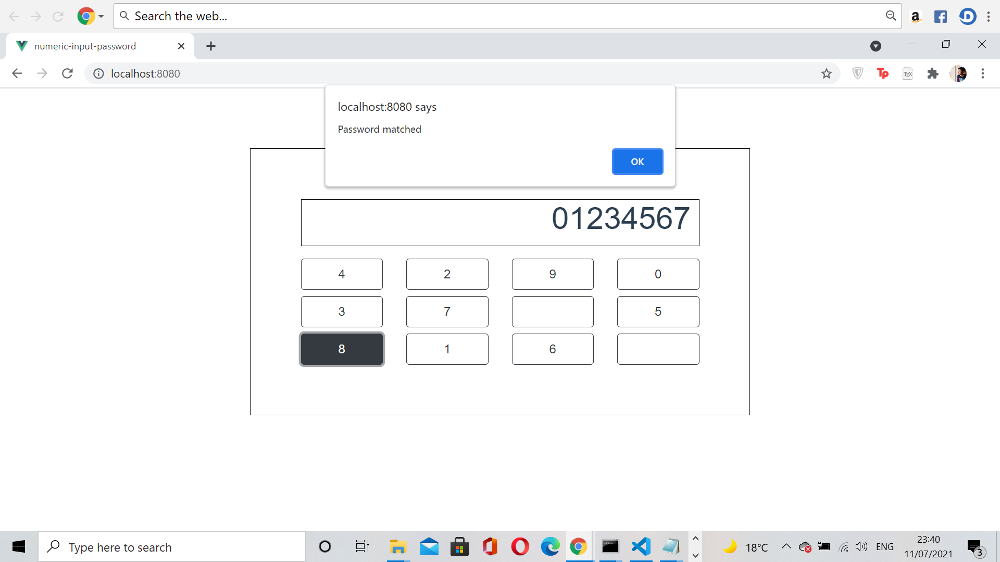

# numeric-input-password

## To run the project

You must have the 'npm' package installed to run this project. Extract the contents of the zip file in any specific directory and open a terminal window (if you're using Windows). Following which, run the command below. 

```
npm run serve 
```

](images/run-serve.png)

Open the localhost path that gets displayed on the terminal on your browser. The 'user password' is 012345678. Type any random password (current password). If it matches with the 'user password', an alert gets displayed that the password is correct. Otherwise, the 'current password' gets reset. The numerical buttons are also randomized.





### For unit testing

For unit testing, open the terminal window and go to the file directory. Run the following command.

```
npm run test:unit
```

](images/unit.png)


